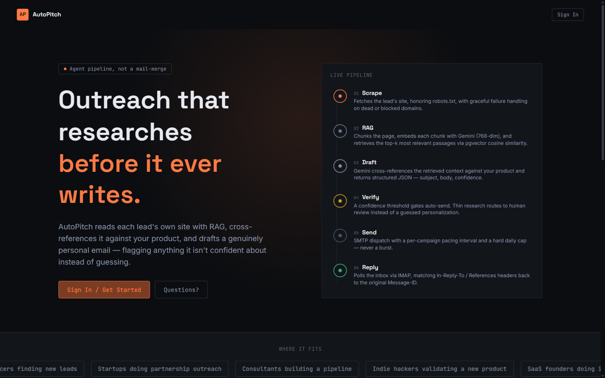

<div align="center">

# AutoPitch

**An agentic cold outreach engine — an AI agent that researches each lead, drafts a genuinely personalized email, and knows when *not* to send one.**

[**🔴 Live App**](https://frontend-chaitu11106-coders-projects.vercel.app) &nbsp;·&nbsp; [Backend API Docs](https://autopitch-backend-0u0u.onrender.com/docs) &nbsp;·&nbsp; [Repo](https://github.com/chaitanya-link/autopitch)



</div>

---

## What this is

Most "AI outreach" tools mail-merge a template with `{{first_name}}` swapped in. AutoPitch doesn't template — it runs an explicit, visible agent pipeline per lead:

1. **Scrape** the lead's own company site (robots.txt-respecting, fails gracefully)
2. **RAG** — chunk the content, embed it, retrieve the most relevant passages via vector similarity
3. **Draft** — an LLM cross-references that retrieved context against *your* product and writes a specific, non-generic opening line
4. **Verify** — the agent scores its own confidence. Thin research routes to human review instead of a guessed personalization — it never sends something it isn't confident about
5. **Send** — dispatched with real per-campaign pacing and a daily cap, never a burst
6. **Reply** — polls the inbox and detects replies by matching email threading headers back to the original send

Every step above is a real, separate stage with its own status — not a single opaque LLM call. The dashboard shows exactly which stage each lead is in, live.

> Try it live: sign up, create a campaign (any product + URL), add a lead (any company + URL), and run it through Research → Draft → Send.

## Why this exists

Built as an end-to-end systems project: real RAG (not a toy demo), an agent that's allowed to say "I'm not confident," actual email infrastructure (SMTP + IMAP, pacing, rate limits), and a UI designed around making an asynchronous multi-step pipeline legible at a glance — not just a chat window bolted onto a CRUD app.

## Architecture

```
┌─────────────┐        ┌──────────────────┐        ┌─────────────────┐
│   React      │  REST  │   FastAPI         │        │   Supabase       │
│   (Vercel)   │◄──────►│   (Render,        │◄──────►│   Postgres +     │
│              │        │    Docker)        │        │   pgvector       │
└─────────────┘        └──────────────────┘        └─────────────────┘
                              │      │
                    ┌─────────┘      └─────────┐
                    ▼                          ▼
            ┌───────────────┐          ┌───────────────┐
            │  Gemini        │          │  Gmail          │
            │  (embeddings +│          │  (SMTP send +   │
            │   drafting)    │          │   IMAP replies) │
            └───────────────┘          └───────────────┘
```

- **Auth**: Supabase Auth (email/password). Every API route verifies the session token server-side and scopes results to the authenticated user's own campaigns/leads — no client can reach another user's data.
- **RAG storage**: Postgres + `pgvector`, cosine similarity search over 768-dim Gemini embeddings.
- **Reply detection**: polls the inbox via IMAP and matches incoming `In-Reply-To`/`References` headers against the `Message-ID` of what was sent — the same mechanism real email clients use for threading, not a polling hack against subject lines.
- **Pacing/rate limiting**: enforced server-side per campaign, independent of the frontend — checks the most recent send timestamp and a rolling daily count before allowing a dispatch.

## Tech stack

| Layer | Choice |
|---|---|
| Frontend | React (Vite) + TypeScript, Tailwind, Supabase JS client |
| Backend | FastAPI (Python), SQLAlchemy |
| Database | Postgres + `pgvector` (Supabase) |
| LLM | Google Gemini — `gemini-embedding-001` (RAG) and `gemini-3.6-flash` (drafting, structured JSON output) |
| Email | Gmail SMTP (send) + IMAP (reply detection) via App Password |
| Auth | Supabase Auth |
| Deploy | Docker on Render (backend), Vercel (frontend) |

## Design

Deliberately not another generic AI-dashboard look — dark "mission control" aesthetic: deep charcoal palette, monospace for all data/status/timestamps, one warm accent reserved strictly for genuinely in-progress states, a recurring status-chip motif (dot + label) that appears identically in the lead table, the detail panel, and the landing page's pipeline diagram.

## Running it locally

```bash
git clone https://github.com/chaitanya-link/autopitch.git
cd autopitch
cp .env.example .env.local            # fill in your own keys — see below
cp frontend/.env.example frontend/.env.local
docker compose --env-file .env.local up --build
```

Frontend on `localhost:3000`, backend on `localhost:8000`. See `.env.example` for exactly which keys are required (Supabase project, Gemini API key, Gmail account + App Password — none are provided, you supply your own).

## Repo structure

```
backend/    FastAPI app — RAG pipeline, drafting agent, mailer (send/pacing/reply-detection), auth
frontend/   React dashboard, landing page, auth screens
docs/       README assets
render.yaml Render blueprint for one-click backend deploy
```

---

<div align="center">

Built end to end by **[Chaitanya Joshi](https://github.com/chaitanya-link)**

</div>
